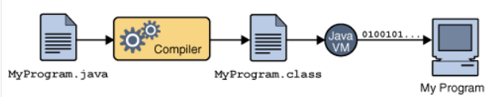
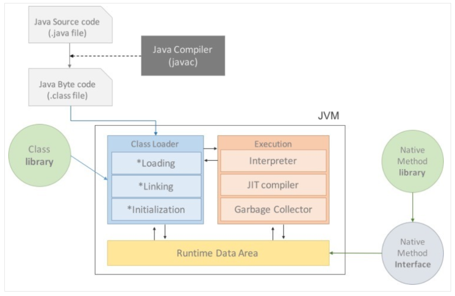
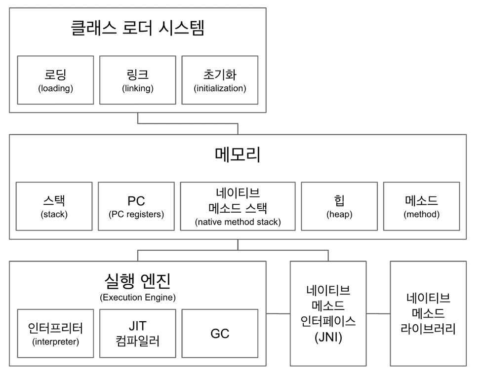
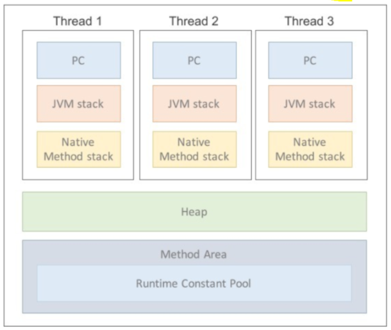
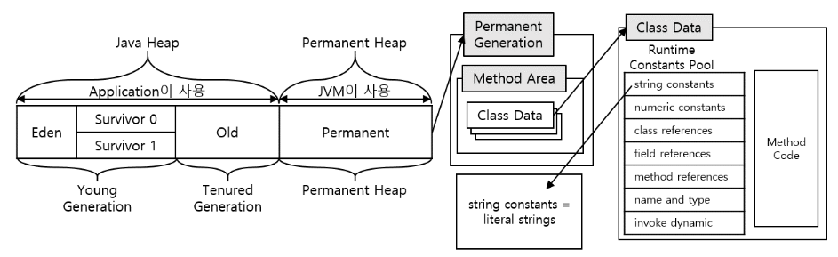
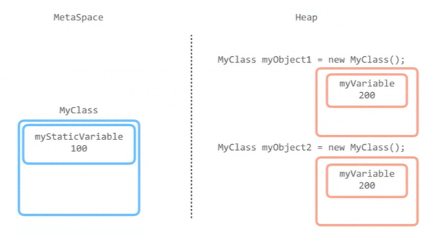
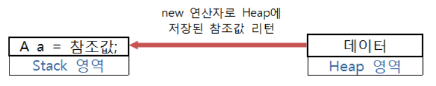

# 스터디 Day 3 JVM, GC

### **\[ JVM(Java Virtual Machine)이란 ? \]**

자바를 실행하기위한 **가상 기계**이다.

Java의 장점 중 하나는 **OS에 종속적이지 않다**는 특징이 있다.

OS 위에서 자바를 실행시키는 것이 JVM이다.



.java파일이 컴파일 된 후 .class파일로 바꿔서 JVM이 인식하고 난 후  
기계어로 컴파일된 파일을 cpu가 인식한다.

c언어같은경우는 컴파일하면 exe파일을 만들어낸다

자바 바이트 코드는 JVM이 이해할 수 있는 언어로 변환된 자바소스코드를 의미한다.

컴파일된 코드의 크기가 1바이트라서 자바 바이트 코드라고 불리고 있다.

바이트 코드는 다시 JIT 컴파일러에 의해 바이너리 코드로 변환된다.


**JIT ( Just In Time )** 컴파일러는 프로그램을 실제 실행하는 시점에  
기계어로 번역하는 컴파일러이다.

for loop 등을 최적화시켜주는것을 JIT컴파일러가 한다.

int a = 10; === int a ; a = 10;과 동일하게 만들어주는것을  
JIT컴파일러가 한다.

인터프리터는 코드를 해석하는 방식이다. 무조건 인터프리티가 필요하다.  
대표적인언어는 자바스크립트나 특히 파이썬이다.

자바는 둘다 지원한다.  
컴파일할때는 javac를 쓰고 인터프리터 방식은 java 명령어를 사용한다.

인터프리터 방식으로 실행하다가 적절한 시점에 바이트 코드 전체를 컴파일하여 기계어로 변경하고,

이후에는 해당 더 이상 인터프리팅 하지 않고 기계어로 직접 실행하는 방식이다.

컴파일할때는 javac를 쓰고 인터프리터 방식은 java 명령어를 사용한다.

<hr/>

## JVM의 구성요소




### JVM은 크게 아래와 같이 이루어져 있다.

- #### 클래스 로더(Class Loader)

  - JVM 내로 클래스 파일(`*.class`)을 로드하고, 링크를 통해 배치하는 작업을 수행하는 모듈이다.

  - 런 타임시 동적으로 클래스를 로드하고 `jar` 파일 내 저장된 클래스들을 JVM 위에 탑재한다.
  - 로딩을 하면서 시큐리티 체크가 일어난다.

    - 샌드박스보안모델이 여기들어간다. 원격으로 클래스파일 실행이 불가능하게 막는다.
    - [자바 샌드박스](<https://ko.wikipedia.org/wiki/%EC%83%8C%EB%93%9C%EB%B0%95%EC%8A%A4_(%EC%BB%B4%ED%93%A8%ED%84%B0_%EB%B3%B4%EC%95%88)>)

  - 즉, 클래스를 처음으로 참조할 때, 해당 클래스를 로드하고 링크하는 역할을 한다.

    - 어느 메모리에 할당해주는것을 링킹이라고 한다.

- #### 실행 엔진(Execution Engine)

  - 인터프리터(Interpreter)
  - JIT 컴파일러(Just-in-Time)
  - 가비지 콜렉터(Garbage Collector)

- #### 런타임 데이터 영역 (Runtime Data Area)

  - 프로그램을 수행하기 위해 OS에서 할당받은 메모리 공간
  - 
  - ##### 메소드 = 클래스 = 스태틱 영역

    - 가장 먼저 데이터가 저장되는곳
    - 클래스 로더로 로딩된 클래스와 메소드정보, 클래스 변수 정보 저장

    - 전역변수, 정적 멤버변수(static)를 저장한다.
    - 프로그램의 시작부터 종료가 될 때 까지 메모리에 남아있는다.
    - 클래스 변수 남발하면 메모리 공간을 잡아먹는다.

    - 자바8버전부터는 개선됐다.

    - 명시적으로 null을 선언할 경우는 GC가 회수
    - 모든 쓰레드가 공유하는 영역이다.

  - ##### 스택

    - 메소드 내에서 정의하는 기본 자료형 (int, double, byte, long, boolean 등) 지역변수의 데이터 값이 저장되는 공간
    - 해당 메소드가 호출될 때 메모리에 할당되고 종료되면 메모리 해제

    ```java
    public class StackAreaEx {

      public static void main(String[] args) {

        int a = 5; // JIT -> int a; a = 5;
        a = 4;
        a = 3;
        a = 2;

        System.out.println(a);
        // Stack 영역은 LIFO(Last In First Out) 구조이다.

        for(int i=0; i < 5; i++){

        }

        System.out.println(i); // error
        // i는 지역변수이므로 for문의 종료와 함께
        // Stack영역에서 해제되었기 때문

      }

    }
    ```

  - ##### 힙 영역

    - 힙영역은 가장중요한 객체영역이다.

    - 객체는 힙영역에 저장된다.

    - 올드영역과 뉴영역으로 둘로 쪼개진다.

    - 한번올라가면 내려가지않는다

    - 힙영역의 주인은 GC이다

      - [Heap Area와 GC](https://www.holaxprogramming.com/2013/07/20/java-jvm-gc/)

    - 네이티브가 들어가면 운영체제

    - 런타임 시 결정되는 참조 자료형이 저장되는곳

      - 런타임시 결정됨에 따라 동작 층의 문제(범위 초과 참조 등)가 발생할 코드임에도 문법의 문제는 아니기에 컴파일 에러를 출력하지 않는다.

    - new 연산자를 통해 생성된 객체가 저장되는 공간

      - 인스턴스 변수도 이곳에 저장된다.

    - 객체를 안쓰거나 명시적 null 선언시 GC가 회수
    - 가비지컬렉터가 활동하는영역은 힙영역이다.
    - [스태틱변수도 힙영역에 저장된다.?](https://jgrammer.tistory.com/144)

      - [static variable은 어디 영역에 속하는가 ?](https://stackoverflow.com/questions/8387989/where-are-static-methods-and-static-variables-stored-in-java)
      - 
      - 
      - Heap의 Permanent Generation영역 변화
      - heap 영역에 포함되어 있기는 하나 heap 영역과는 구분해서 간주함으로 인해
        오라클 문서에서 logical하게는 heap의 한 부분이라고 설명하는 것이다.

    ```
    Java 7 JVM

        <----- Java Heap -----------------> <--- Native Memory --->

        +------+----+----+-----+-----------+--------+--------------+

        | Eden | S0 | S1 | Old | Permanent | C Heap | Thread Stack |

        +------+----+----+-----+-----------+--------+--------------+

                            <--------->

                          Permanent Heap

        S0: Survivor 0

        S1: Survivor 1

    ================================================================


    Java 8 JVM

        <----- Java Heap -----> <--------- Native Memory --------->

        +------+----+----+-----+-----------+--------+--------------+

        | Eden | S0 | S1 | Old | Metaspace | C Heap | Thread Stack |

        +------+----+----+-----+-----------+--------+--------------+


    ```

    - _Permanent 영역은 JVM에 의해 크기가 제한된 영역으로 Java 7까지 유지되었다._

      _따라서 영역 제한으로 인해 메모리 범위 초과 문제가 있었다._

      _대신 Java 8부터는 Permanent Generation을 제거하고 Metaspace로 대체하였고 heap이 아니라_

      _JVM에 의해 메모리가 제한되지 않는 Native Memory 영역으로 전환하여_

      _OS에 의해 메모리 할당 공간이 자동으로 조절되므로 이론상 아키텍쳐가 지원하는 메모리 크기까지 확장할 수 있다._

      _따라서, 애매하게 heap에 걸쳐있던 permanent 영역이 non-heap이라고 구분하던 과거와는 달리_

      _명확하게 method area는 heap이 아니라고 정의할 수 있게 되었다_

      _변경 이유는 ArrayList와 같은 레퍼런스 타입의 동적 배열 객체를 static으로 생성하면_

      _레퍼런스를 Permanent 영역에 저장하는데 해당 객체 배열에 객체 원소를 추가하면_

      _그대로 static object의 레퍼런스가 Permanent 영역에 쌓일 뿐만 아니라 string literal data를 저장하던_

      _string pool도 permanent 영역에 저장하느라 OOM 에러가 발생하는 이슈가 잦았다고 한다._

    - 참조형의 데이터 타입을 갖는 객체, 배열 등은 Heap 영역에 데이터가 저장된다.

      - [기본형 변수와 참조형 변수?](https://velog.io/@yh20studio/Java-%EA%B8%B0%EB%B3%B8%ED%98%95-%EB%B3%80%EC%88%98%EC%99%80-%EC%B0%B8%EC%A1%B0%ED%98%95-%EB%B3%80%EC%88%98)

    - 변수는 Stack 영역의 공간에서 실제 데이터가 저장된 Heap 영역의 참조값 ( 메모리에 저장된 주소를 연결해 주는 값)  
      을 new 연산자를 통해 리턴받는다.

    - 실제 데이터를 갖고있는 Heap 영역의 참조 값을 Stack 영역의 객체가 갖고있다.

    ```java
    public class HeapAreaEx01 {

      public static void main(String[] args) {

        int[] a = null; // int형 배열 선언 및 Stack 영역 공간 할당

        System.out.println(a); // 결과 : null

        a = new int[5]; // Heap 영역에 5개의 연속된 공간 할당 및

        // 변수 a에 참조값 할당

        System.out.println(a); // 결과 : @15db9742 (참조값)

      }

    }

    ================================================================

    public class HeapAreaEx02 {

      public static void main(String[] args) {

        String str1 = new String("joker");

        String str2 = new String("joker");

        if(str1 == str2){

          System.out.println("같은 주소값 입니다.");

        }else{

          System.out.println("다른 주소값 입니다.");

        }

      }

    }

    결과값: 다른 주소값 입니다.

    ================================================================

    class A{}

    public class HeapArea {

      public static void main(String[] args) {

        A a = null; // A타입의 a객체 선언 및 Stack 영역 공간 할당

        System.out.println(a); // 결과 : null

        a = new A(); // Heap 메모리에 공간 할당 및 객체(a)에 참조값 할당

        System.out.println(a); // 결과 : @15db9742

      }

    }
    ```

    - 
    - Heap에 저장된 데이터가 더 이상 사용이 불필요하다면 메모리 관리를 위해 GC에 의해 알아서 해제된다

- ##### PC 레지스터

  - JVM이 수행할 명령어의 주소를 저장하는공간

  - OS의 PC 레지스터와 유사한 역할이나 CPU와는 별개로 JVM이 관리

  - 쓰레드가 시작될 때마다 각 쓰레드 별로 생성됨

- ##### 네이티브 메소드 스택

  - 바이트 코드가 아닌 기계어로 작성된 코드를 실행하는 공간
  - 다른 언어(c/c++)로 작성된 코드를 수행하기 위함
  - Java Native Interface를 통해 바이트 코드로 변환됨
  - Java Code를 수행하다 JNI 호출 시 Java Stack에서 Native Stack으로 동적 연결(Dynamic Linking)을 통해 확장됨

  - 따라서 나뉘어졌다고는 하나 stack에서 연결할 수 있음

  - JNI(Java Native Interface) 호출 시 생성
  - 각 쓰레드 별로 생성

<hr/>

#### GC의 종류

[GC의 방법과 종류](https://deveric.tistory.com/64)

#### FULL GC의 서버 다운 ?

[GC overhead limit exceed, Tomcat 서버 다운 1](https://extsdd.tistory.com/257)

[GC overhead limit exceed, Tomcat 서버 다운 2](https://extsdd.tistory.com/258)
